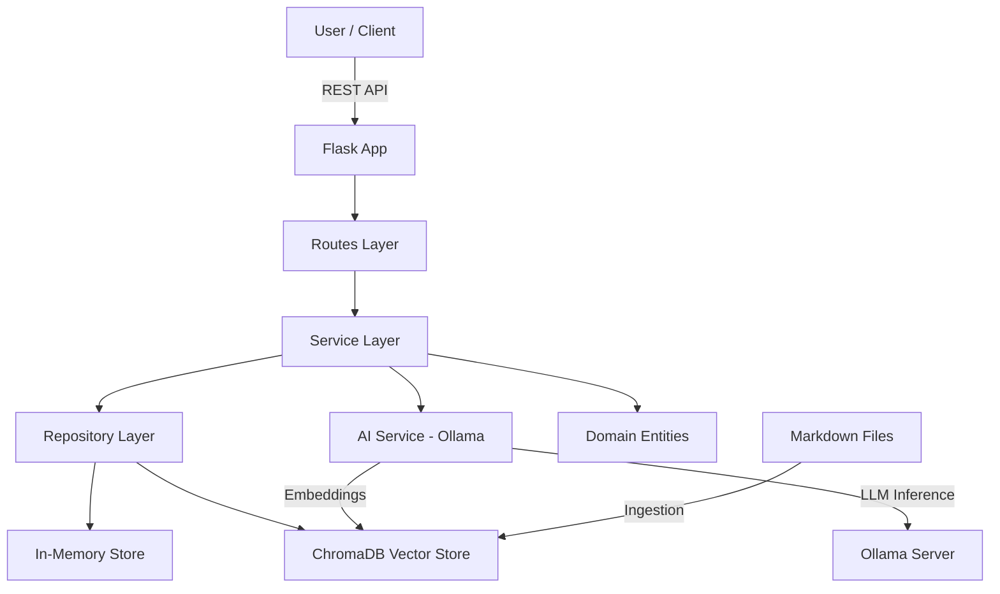

# RecallMind - AI-Powered Study Assistant

[](https://github.com/krishnakumarbhat/ObsidianRep/actions/workflows/ci.yml)

RecallMind is a comprehensive Python-based study assistant that adapts the functionality of the Node.js RecallMind application. It provides AI-powered Q&A capabilities, flashcard management, study sessions, and quiz generation using a clean, SOLID-principle-based architecture.

## 🏗️ Architecture



The application follows **SOLID principles** and implements several design patterns:

### Core Principles

- **Single Responsibility Principle**: Each class has one reason to change
- **Open/Closed Principle**: Open for extension, closed for modification
- **Liskov Substitution Principle**: Derived classes are substitutable for base classes
- **Interface Segregation Principle**: Clients depend only on interfaces they use
- **Dependency Inversion Principle**: Depend on abstractions, not concretions

### Design Patterns

- **Repository Pattern**: Data access abstraction
- **Service Layer Pattern**: Business logic encapsulation
- **Factory Pattern**: Application and service creation
- **Dependency Injection**: Loose coupling between components

## 📁 Project Structure

```
RecallMind/
├── domain/                     # Domain layer - business entities
│   ├── __init__.py
│   ├── entities.py            # Core business entities
│   └── value_objects.py       # Value objects
├── repositories/              # Repository layer - data access
│   ├── __init__.py
│   ├── interfaces.py          # Repository interfaces
│   ├── memory_repository.py   # In-memory implementations
│   └── vector_repository.py   # Vector database implementation
├── services/                  # Service layer - business logic
│   ├── __init__.py
│   ├── deck_service.py        # Deck management
│   ├── flashcard_service.py   # Flashcard management
│   ├── study_service.py       # Study sessions
│   ├── test_service.py        # Quiz and tests
│   ├── ai_service.py          # AI-powered features
│   └── initialization_service.py  # App initialization
├── app/                      # Application layer - API
│   ├── __init__.py           # Flask app factory
│   ├── routes.py             # Main API routes
│   ├── flashcard_routes.py   # Flashcard endpoints
│   ├── study_routes.py       # Study session endpoints
│   └── ai_routes.py          # AI endpoints
├── data/                     # Data directory for markdown files
├── chroma_db/               # Vector database storage
├── config.py                # Configuration settings
├── requirements.txt         # Python dependencies
├── run.py                   # Application entry point
└── README.md               # This file
```

## 🚀 Features

### Core Features

- **Flashcard Management**: Create, organize, and manage study decks
- **AI-Powered Q&A**: Ask questions about your study materials using RAG
- **Study Sessions**: Track learning progress with detailed analytics
- **Quiz Generation**: AI-generated multiple-choice questions
- **Vector Search**: Semantic search through your study materials
- **Automatic Data Ingestion**: Processes markdown files on startup

### Technical Features

- **RESTful API**: Complete REST API with proper HTTP status codes
- **Async Support**: Asynchronous operations for better performance
- **Error Handling**: Comprehensive error handling and validation
- **Data Validation**: Input validation using domain models
- **Modular Design**: Clean separation of concerns

## 🛠️ Installation & Setup

### Prerequisites

- Python 3.8+
- Ollama (for AI models)
- Git

### 1. Clone the Repository

```bash
git clone <repository-url>
cd RecallMind
```

### 2. Install Dependencies

```bash
pip install -r requirements.txt
```

### 3. Set Up Ollama

Install and run Ollama, then pull the required models:

```bash
# Install Ollama (visit https://ollama.ai for installation instructions)
ollama pull nomic-embed-text:latest
ollama pull deepseek-r1:latest
```

### 4. Configure Data Directory

Update `config.py` to point to your markdown files directory:

```python
DATA_DIRECTORY = "/path/to/your/study/materials"
```

### 5. Run the Application

```bash
python run.py
```

The application will be available at `http://localhost:5000`

## 📚 API Documentation

### Health Check

```http
GET /api/health
```

### Deck Management

```http
GET    /api/decks              # Get all decks
GET    /api/decks/{id}         # Get specific deck
POST   /api/decks              # Create new deck
PUT    /api/decks/{id}         # Update deck
DELETE /api/decks/{id}         # Delete deck
```

### Flashcard Management

```http
GET    /api/decks/{id}/flashcards    # Get deck flashcards
POST   /api/flashcards               # Create flashcard
PUT    /api/flashcards/{id}          # Update flashcard
DELETE /api/flashcards/{id}          # Delete flashcard
```

### Study Sessions

```http
POST   /api/study-sessions                    # Start study session
PUT    /api/study-sessions/{id}               # End study session
POST   /api/card-reviews                      # Record card review
GET    /api/study-sessions/{id}/progress      # Get study progress
```

### AI Features

```http
POST   /api/chat/ask                    # Ask AI question
GET    /api/chat/messages               # Get chat history
POST   /api/quiz/generate/{deck_id}     # Generate quiz question
```

### User Statistics

```http
GET    /api/stats              # Get user statistics
PUT    /api/stats              # Update user statistics
```

### Data Management

```http
POST   /api/data/reingest      # Re-ingest all data
```

## 🔧 Configuration

### Environment Variables

Create a `.env` file in the project root:

```env
FLASK_ENV=development
FLASK_DEBUG=True
DATA_DIRECTORY=/path/to/your/data
CHROMA_PERSIST_DIRECTORY=chroma_db
EMBEDDING_MODEL=nomic-embed-text:latest
LLM_MODEL=deepseek-r1:latest
```

### Configuration Options

Edit `config.py` to customize:

- **Data Directory**: Where your markdown files are stored
- **Vector Database**: ChromaDB storage location
- **AI Models**: Ollama model names
- **API Settings**: Port, host, and other API configurations

## 📖 Usage Examples

### Creating a Deck

```python
import requests

# Create a new deck
response = requests.post('http://localhost:5000/api/decks', json={
    'name': 'Python Programming',
    'description': 'Basic Python concepts',
    'difficulty': 'beginner'
})
deck = response.json()
```

### Adding Flashcards

```python
# Add a flashcard to the deck
response = requests.post('http://localhost:5000/api/flashcards', json={
    'deck_id': deck['id'],
    'question': 'What is a variable in Python?',
    'answer': 'A variable is a container for storing data values.'
})
```

### Starting a Study Session

```python
# Start studying
response = requests.post('http://localhost:5000/api/study-sessions', json={
    'deck_id': deck['id']
})
session = response.json()
```

### Asking AI Questions

```python
# Ask the AI about your study materials
response = requests.post('http://localhost:5000/api/chat/ask', json={
    'question': 'Explain Python data types'
})
answer = response.json()
```

## 🧪 Testing

### Running Tests

```bash
# Install test dependencies
pip install pytest pytest-asyncio

# Run tests
pytest tests/
```

### API Testing

Use tools like Postman or curl to test the API:

```bash
# Health check
curl http://localhost:5000/api/health

# Get all decks
curl http://localhost:5000/api/decks

# Create a deck
curl -X POST http://localhost:5000/api/decks \
  -H "Content-Type: application/json" \
  -d '{"name": "Test Deck", "difficulty": "beginner"}'
```

## 🔍 Troubleshooting

### Common Issues

1. **Ollama Connection Error**
   - Ensure Ollama is running: `ollama serve`
   - Check if models are installed: `ollama list`

2. **Vector Database Issues**
   - Delete `chroma_db` folder to reset
   - Check data directory permissions

3. **Import Errors**
   - Ensure all dependencies are installed: `pip install -r requirements.txt`
   - Check Python version compatibility

4. **Data Ingestion Fails**
   - Verify data directory exists and contains `.md` files
   - Check file permissions and encoding

### Debug Mode

Enable debug mode in `config.py`:

```python
DEBUG = True
```

## 🤝 Contributing

1. Fork the repository
2. Create a feature branch: `git checkout -b feature-name`
3. Make your changes following SOLID principles
4. Add tests for new functionality
5. Submit a pull request

### Code Style

- Follow PEP 8 guidelines
- Use type hints where possible
- Write comprehensive docstrings
- Maintain SOLID principles

## 📄 License

This project is licensed under the MIT License - see the LICENSE file for details.

## 🙏 Acknowledgments

- Inspired by the original RecallMind Node.js application
- Built with Flask, LangChain, and ChromaDB
- AI capabilities powered by Ollama

## 📞 Support

For issues and questions:

1. Check the troubleshooting section
2. Review the API documentation
3. Open an issue on GitHub
4. Check the logs for error details

---

**RecallMind** - Empowering learning through AI and clean architecture! 🚀
